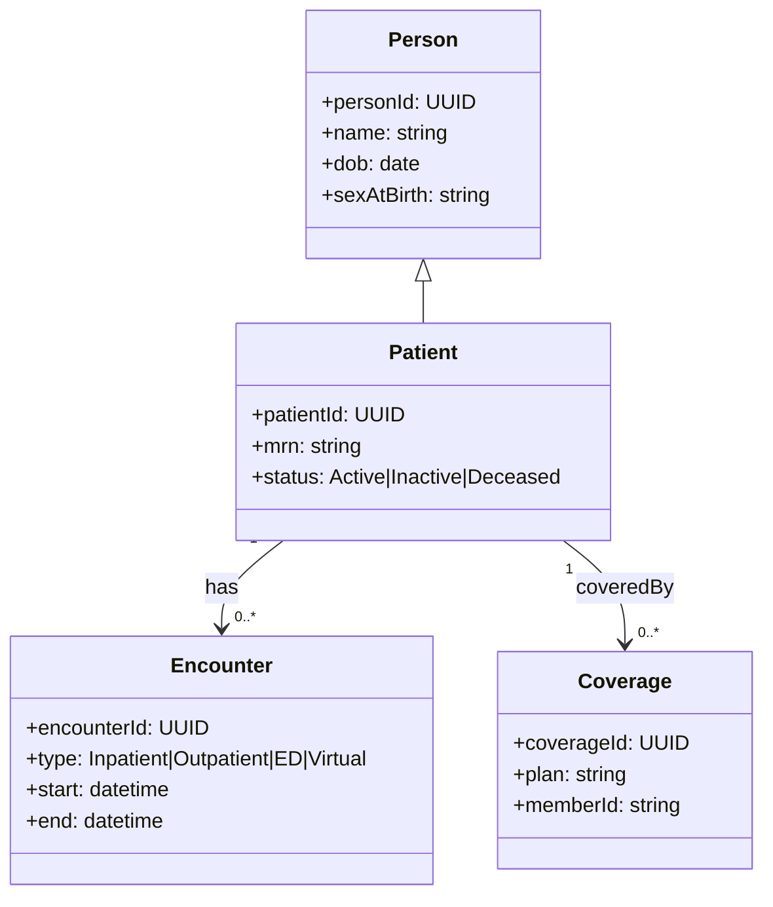

# Patient Hierarchy UML

```mermaid
classDiagram
direction TB

class Person {
  +personId: UUID
  +name: string
  +dob: date
  +sexAtBirth: string
}

class Patient {
  +patientId: UUID
  +mrn: string
  +status: Active|Inactive|Deceased
}

class Encounter {
  +encounterId: UUID
  +type: Inpatient|Outpatient|ED|Virtual
  +start: datetime
  +end: datetime
}

class Coverage {
  +coverageId: UUID
  +plan: string
  +memberId: string
}

Person <|-- Patient
Patient "1" --> "0..*" Encounter : has
Patient "1" --> "0..*" Coverage : coveredBy
```